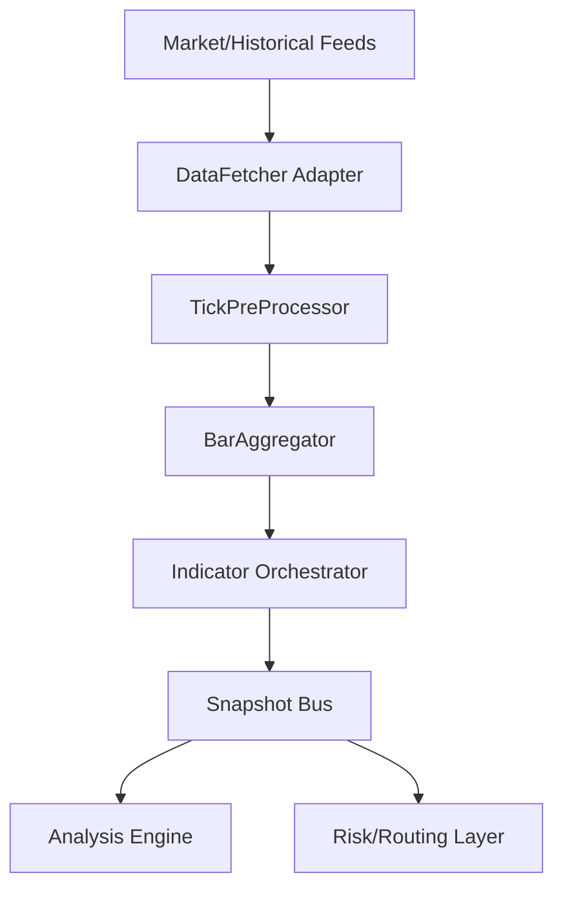

# Kiến trúc Analysis Preprocessor Engine

## Sơ đồ tổng quan

## Luồng dữ liệu

1. **Feeds**: nhận tick từ broker, file, hoặc simulator.
2. **Adapter**: chuyển đổi định dạng, đẩy vào `TickPreProcessor`.
3. **PreProcessor**: làm sạch, chuẩn hóa timezone, loại duplicate, phát event tick sạch.
4. **BarAggregator**: gom tick theo timeframe, phát bar đóng cùng metadata.
5. **Indicator Orchestrator**: chạy calculators (SMA, EMA, RSI, ATR, advanced…) và tạo `EnrichedMarketData`.
6. **Snapshot Bus**: đóng gói kết quả thành `PreprocessorSnapshot` và emit tới Analysis Engine/chiến lược.

## Thành phần

- **Core Engine**: quản lý pipeline, thread scheduling, lifecycle (`Start/Stop/Restart`).
- **Indicator Layer**: orchestrator + calculators với khả năng chạy song song và caching.
- **Data Layer**: models (`Tick`, `Bar`, `IndicatorResult`), cache (`CircularBuffer`, `TickCache`, `BarCache`).
- **Integration Layer**: adapter kết nối DataFetcher, backward-compat bridge cho chiến lược cũ.

## Ràng buộc hiệu năng

- Thời gian xử lý 1 tick (preprocess + publish) < 10 ms.
- Latency giữa tick → snapshot < 30 ms ở load 1k tps.
- Bộ nhớ tối đa cho cache mặc định ~50 MB (có cấu hình).
- Indicator recalculation ưu tiên incremental để tránh O(n) mỗi tick.

## Khả năng mở rộng

- Indicator orchestrator hỗ trợ đăng ký động, ghi đè cấu hình từng calculator.
- Snapshot bus hỗ trợ nhiều subscriber qua event hoặc channel (System.Threading.Channels gợi ý).
- Có thể chạy nhiều pipeline song song (per-symbol) nhờ context độc lập.

## PatternLayer trong MarketTrendAnalyzer

- **Vị trí**: là layer thứ tư của `MarketTrendAnalyzer`, chạy sau Structure/MAs/Momentum để bổ sung thông tin “smart money footprints”.
- **Cấu trúc**: `PatternLayer` gom kết quả từ danh sách `IPatternDetector` (mặc định `LiquidityAnalyzer` + `BreakoutQualityEvaluator`) và áp dụng trọng số cấu hình để trả về điểm tổng.
- **Data contract**: mọi detector dùng `SnapshotDataAccessor` để đọc lịch sử đa timeframe. Lịch sử này được populate qua `SnapshotHistoryRegistry` nhằm chia sẻ `barHistory` giữa `Preprocessor` và các layer.
- **Chuỗi chấm điểm**:
    1. Detector đọc dữ liệu và trả `PatternDetectionResult` (score, confidence, flags, diagnostics).
    2. `PatternLayer` gom `flags`, ghi telemetry (confirmations/warnings) và tính trung bình trọng số.
    3. Layer trả về điểm chuẩn hóa 0..100; MarketTrendAnalyzer dùng điểm này cùng pattern flags để tăng/giảm `TrendSignal.Confidence`.
- **Feature Flags**: `UsePatternLayer` bật/tắt toàn bộ layer. Trọng số layer (`LayerWeights.Patterns`) và từng detector (`PatternLayerConfig`) xác định mức ảnh hưởng cuối cùng.

## Chiến lược lỗi & telemetry

- Mọi bước pipeline log structured event (`component`, `latency`, `status`).
- Khi calculator lỗi: đánh dấu snapshot degraded nhưng vẫn phát dữ liệu khác.
- Health metrics: throughput, queue depth, CPU/memory footprint.

## Phụ thuộc chính

- `DataFetcher` (hoặc nguồn tương đương) cho models và data feed.
- `Telemetry` cho metrics/log.
- `Analysis` cho consumer downstream.
