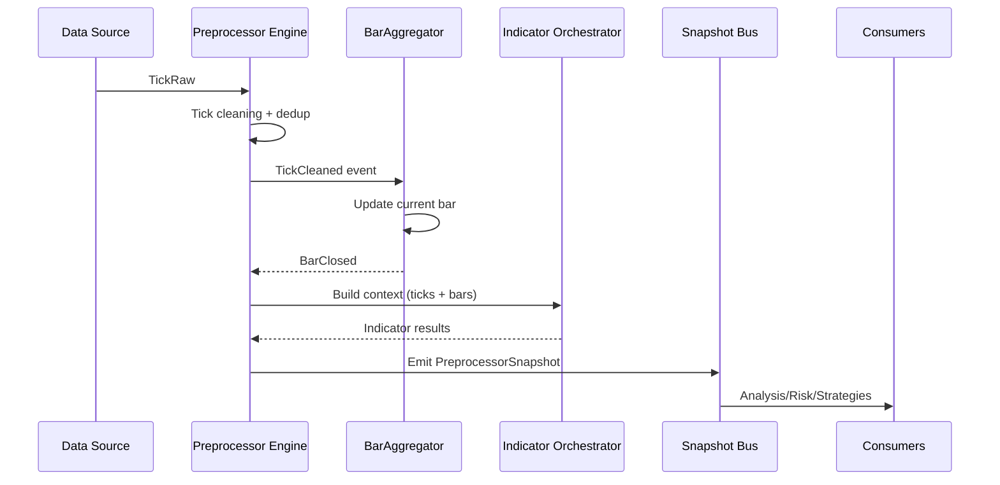

# Data Flow

## Tổng quan

## Chi tiết bước

1. **Tick cleaning**
   - Chuẩn hóa timezone, check duplicate timestamp, option gap-filling.
2. **Bar aggregation**
   - Gom tick theo timeframe cấu hình (đa timeframe song song).
   - Khi bar đóng, thêm vào cache và phát sự kiện.
3. **Context build**
   - Thu thập recent ticks, bars, account info, metadata.
4. **Indicator calculation**
   - Orchestrator chạy các calculators, hỗ trợ chạy song song.
5. **Snapshot publish**
   - Gộp kết quả indicator + dữ liệu gốc → `PreprocessorSnapshot`.
   - Đẩy ra bus cho nhiều subscriber.

## Error flow

- Nếu tick lỗi parse: log cảnh báo, bỏ qua tick.
- Nếu calculator throw: đánh dấu `IsDegraded = true`, ghi reason.
- Nếu latency vượt ngưỡng: raise telemetry event để autoscale.
